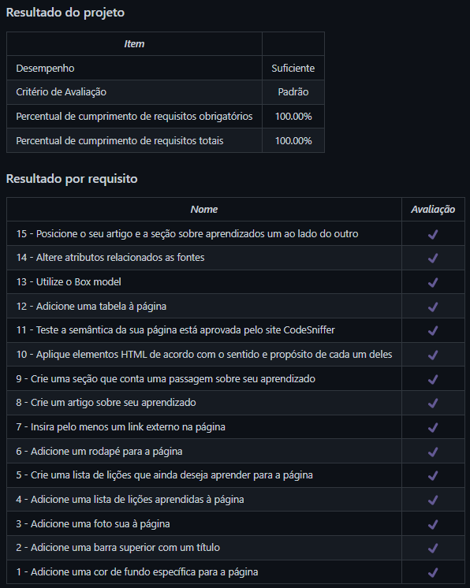

# Lessons Learned
Projeto da [Trybe](https://www.betrybe.com/) - Bloco 3 - Página feita com HTML e CSS.

## 💻 Projeto

Página em HTML e CSS com informações sobre os aprendizados dos três primeiros blocos do curso da Trybe.

  
<strong>🏆 Meu desempenho</strong>
 

  

## 🚀 Tecnologias
> Este projeto foi desenvolvido com as seguintes tecnologias:

- HTML
- CSS

## 📌 Habilidades
> Neste projeto, desenvolvi as seguintes habilidades:

- Utilizar HTML para construir páginas WEB;
- Utilizar HTML semântico para tornar a página mais acessível e melhor ranqueada;
- Utilizar CSS para adicionar estilo e posicionar elementos.

## 💬 Contatos

   
   
  

<!-- ## 📄 Licença

Esse projeto está sob licença. Veja o arquivo [LICENÇA](LICENSE.md) para mais detalhes.

[⬆ Voltar ao topo](#nome-do-projeto)  -->
